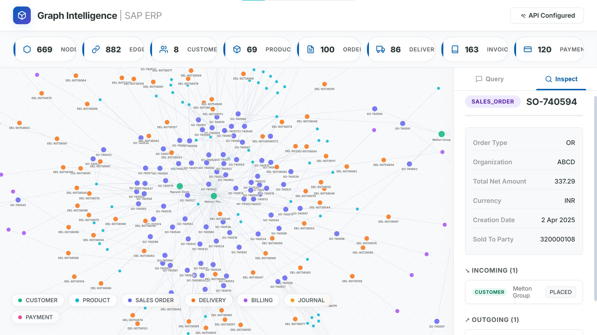
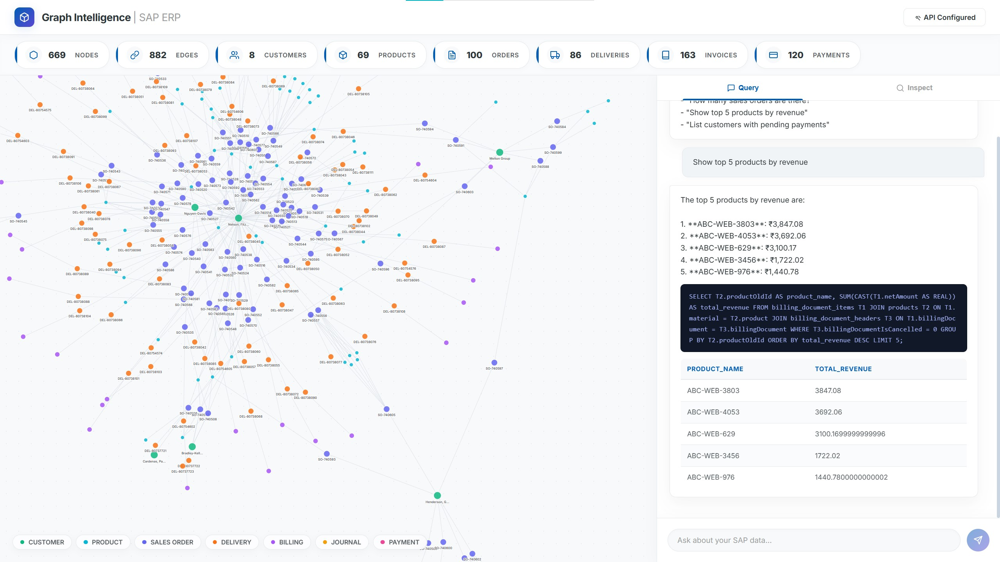
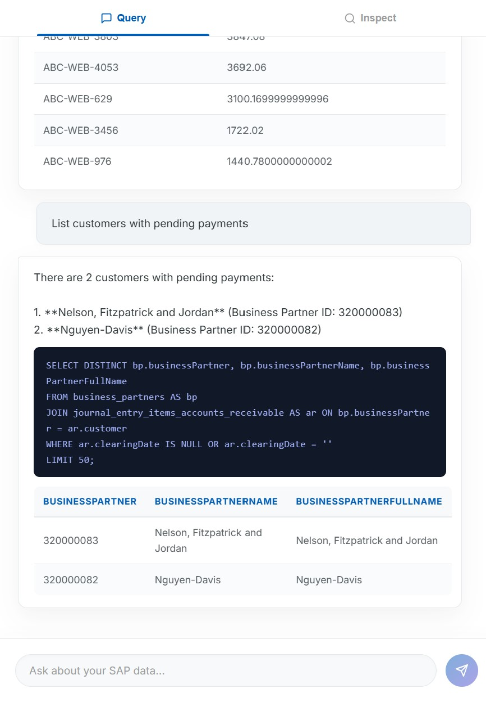
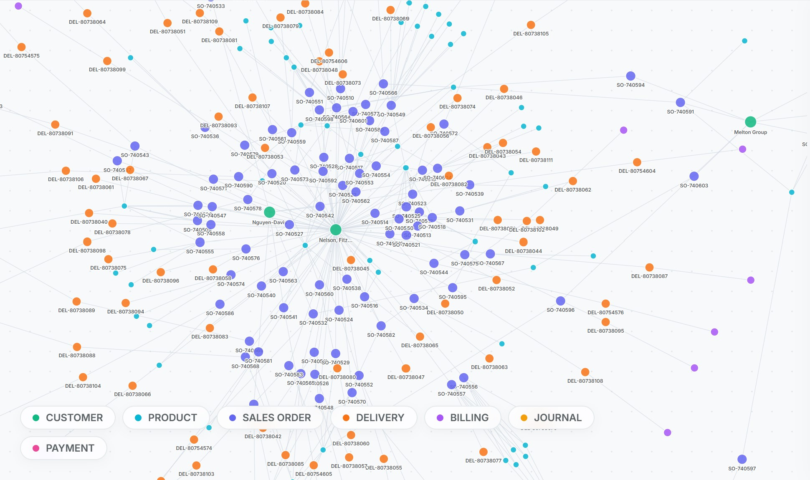

# SAP Graph Intelligence System

## Overview
SAP Graph Intelligence is a highly advanced, full-stack application designed to transform raw SAP ERP data into an interactive Knowledge Graph and provide a Natural Language-to-SQL interface. It enables modern, non-technical business users to explore complex relational ERP data (Sales, Billing, Products, Deliveries) simply by asking questions in plain English.

## Visual Dashboard & AI Agent






## Architecture Decisions

The system is separated into a decoupled backend and frontend for maximum scalability.

### Backend (Python / FastAPI)
- **Framework:** FastAPI was chosen for its excellent asynchronous performance, automatic OpenAPI documentation, and strict data validation using Pydantic.
- **Graph Engine:** NetworkX builds an in-memory graph from the relational database, calculating connected components and degree centralities to rapidly serve the frontend visualization.
- **LLM Pipeline:** Handled dynamically via `llm_engine.py`, connecting our text-to-SQL layer with Google's Gemini models.

### Frontend (React / Vite)
- **Build Tool:** Vite provides ultra-fast Hot Module Replacement (HMR) during development and highly optimized production builds.
- **Visualization:** D3.js was chosen for the force-directed graph because it can uniquely handle rendering hundreds of nodes and complex SAP relationships with smooth physics and interactivity.
- **Design System:** We implemented a custom, "Pristine White Enterprise" aesthetic—prioritizing readability, data density, and a professional glassmorphic UI.

---

## Database Choice
**Choice:** SQLite (via Python `sqlite3`)

**Reasoning:**
1. **Portability & Speed:** For this assessment, SQLite provides zero-configuration, lightning-fast reads, and can easily embed inside the Docker container without needing an external Database server (like Postgres).
2. **Text-to-SQL Reliability:** LLMs (like Gemini/Claude) have massive amounts of training data on SQLite dialects, making standard SQL generation highly accurate and less prone to edge-case syntax errors.
3. **Data Ingestion:** Utilizing Pandas to seamlessly parse 18 JSONL tables directly into SQLite tables was exceptionally efficient and robust for a graph-relational hybrid setup.

---

## LLM Prompting Strategy

The Natural Language interface runs on Gemini models with a precise Prompt Engineering strategy:

1. **Explicit Schema Injection:** The prompt explicitly provides the core database schema (e.g., `products`, `sales_order_headers`, etc.) and the exact relationship keys.
2. **Implicit Rule Handling:** We define rules in the prompt to correct known parsing anomalies (e.g., instructing the LLM that boolean fields like `billingDocumentIsCancelled` are stored as integers `0` and `1` rather than text, preventing silent failure).
3. **Format Enforcement:** The core prompt strictly mandates outputting *only* the SQL query to prevent markdown artifacts from breaking the execution engine.

---

## Guardrails & Security

To ensure enterprise-level safety, we implemented robust guardrails inside `llm_engine.py`:

1. **Domain Checking:** Before hitting the LLM, the system validates the question against a predefined list of allowed SAP/ERP domains (e.g., "sales", "invoice", "product"). Off-topic questions are immediately rejected, saving API costs.
2. **Read-Only SQL Validation:** Even if the LLM hallucinates, we have a firm regex-based interceptor that scans the resulting SQL. If the SQL contains `DROP`, `DELETE`, `UPDATE`, `INSERT`, `ALTER`, or does not start with `SELECT`, the execution is immediately blocked.

---

## Local Setup Instructions

### Prerequisites
- Python 3.10+
- Node.js 18+
- A Google Gemini API Key

### Backend
1. `cd backend`
2. `pip install -r requirements.txt`
3. Rename `.env.example` to `.env` and add your API key: `GEMINI_API_KEY=your_key_here`
4. Start the server:
   ```bash
   uvicorn main:app --reload
   ```

### Frontend
1. `cd frontend`
2. `npm install`
3. Start the dev server:
   ```bash
   npm run dev
   ```
4. Open the provided `localhost` link to view the dashboard!
